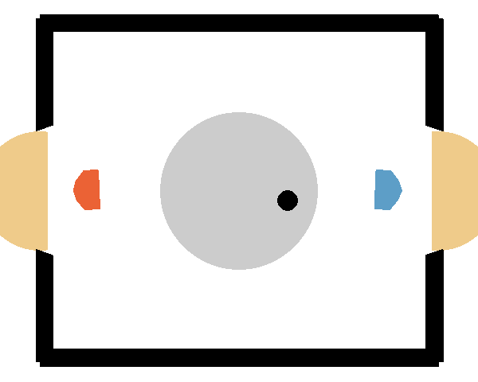

# Hockey Reinforcement Learning Challenge





## Quick Links 🔗
- [Hockey Environment Repository](https://github.com/martius-lab/laser-hockey-env)
- [Competition Server Repository](https://github.com/martius-lab/comprl/)
- [Client Code Repository](https://github.com/martius-lab/comprl-hockey-agent)
- [Gymnasium Documentation](https://gymnasium.farama.org/)


## Project Overview 🎯
This repository contains the implementation of a Reinforcement Learning agent for a simulated hockey game. The project is part of the RL course curriculum, focusing on developing and evaluating different RL algorithms.

### Tournament Model
The implementation used during the final tournament builds on top of [Stable-baselines3's](https://stable-baselines3.readthedocs.io/en/master/) [Soft Actor-Critic](https://arxiv.org/abs/1801.01290) by adhancing its ReplayBuffer through [Emphasizing Recent Experience](https://arxiv.org/abs/1906.04009) and [Prioritized Experience Replay](https://arxiv.org/abs/1511.05952). The repository also contains an implementation of [SAC-CEPO](https://arxiv.org/abs/2112.11115) which was not used during the tournament due to computational cost. The final SAC agent was thoroughly trained using selfplay. 


### Environment
The project uses a custom hockey environment built on the Gymnasium API (formerly OpenAI Gym). The environment provides different training modes:
- `NORMAL`: Standard gameplay against another agent
- `TRAIN_SHOOTING`: Practice hitting a static puck into the goal
- `TRAIN_DEFENSE`: Practice defending against incoming shots

## Competition Setup 🏆
Team name:
PytorchPedalPushers-SAC

- Competition server is running at: http://comprl.cs.uni-tuebingen.de

### Selfplay Framework
The Selfplay Method uses an Elo System to sample opponents from an Opponent Pool. The core logic can be found in [`src/utils/selfplay_utils.py`](src/utils/selfplay_utils.py).

## Getting Started 🚀

### Installation
```bash
pip install -r requirements.txt
```


#### Run Model Training and Evaluation

Run the **main.py** and specify the corresponding configs that contain the desired method and mode (training, evaluation, hp_tuning, selfplay) using hydra. For example to train SAC with default parameters, type:

```bash
python3 ./main.py algorithm=sac mode=train 
```

and hydra will automatically compose *configs/mode/train.yaml*, *configs/algorithm/sac.yaml* and *configs/config.yaml* together.

To see the results in tensorboard:

```bash
tensorboard --logdir=./logs/
```

Example of using the test mode to have two models play against each other:

```bash
python main.py algorithm=sac mode=test checkpoint.load_from=models/run_2025-02-24_02-16-37 checkpoint.model_name=model_1240806 algorithm.params.replay_buffer_class=ERE mode.opponent_checkpoint.load_from=models/run_2025-02-22_18-01-57 mode.opponent_checkpoint.model_name=final_model mode.render=True mode.change_sides=True mode.n_test_episodes=10
```

To rewatch a game from the competition server add the corresponding .pkl file in the *game_data* folder (root_level) and run
```
python client/replay_game.py
```


### Using the TCML Cluster

Set up a .env file and set TCML_USERNAME and TCML_PASSWORD. Afterwards, to connect to the TCML cluster using ssh run 

```bash
TCML.bat
```

Building the container:

```bash
singularity build --fakeroot /path/to/container.sif container.def
```

Running Scripts in the Container:

```bash
singularity run /path/to/container.sif python3 ./my_script.py
```

### References

- [implementation of the ERE+PER ReplayBuffer](https://github.com/BY571/Soft-Actor-Critic-and-Extensions/tree/master)
- [Implementation of the SAC-CEPO](https://github.com/wcgcyx/SAC-CEPO/tree/master)

